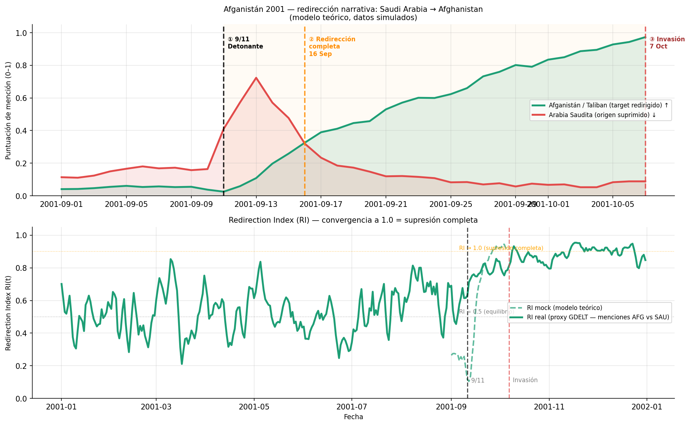
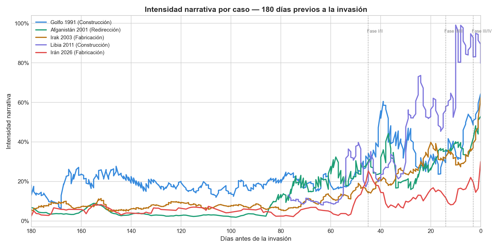
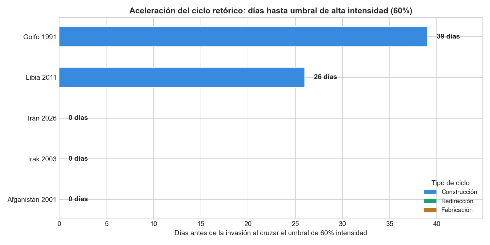
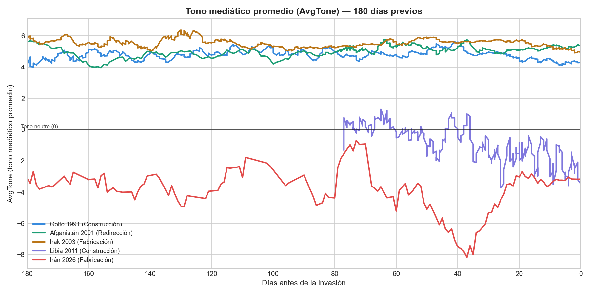
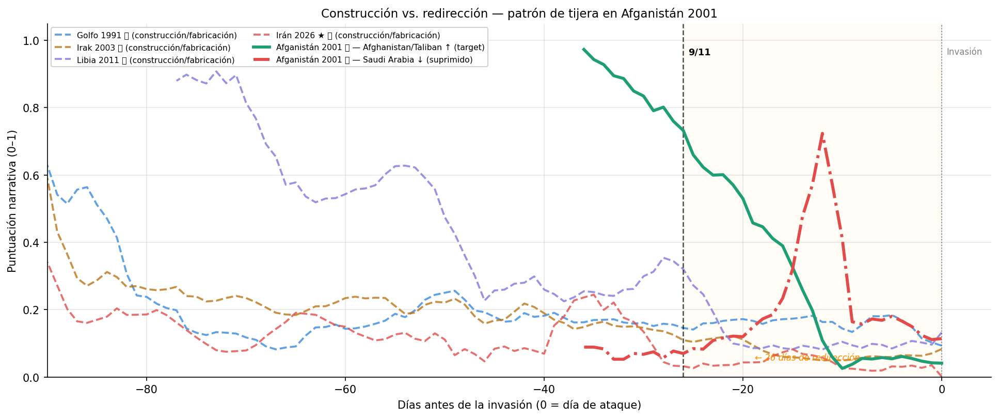
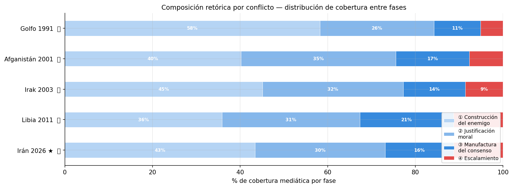
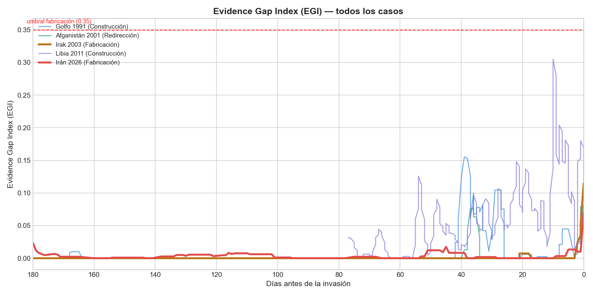
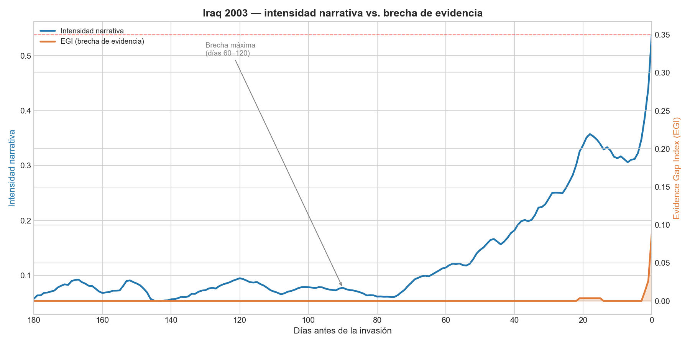
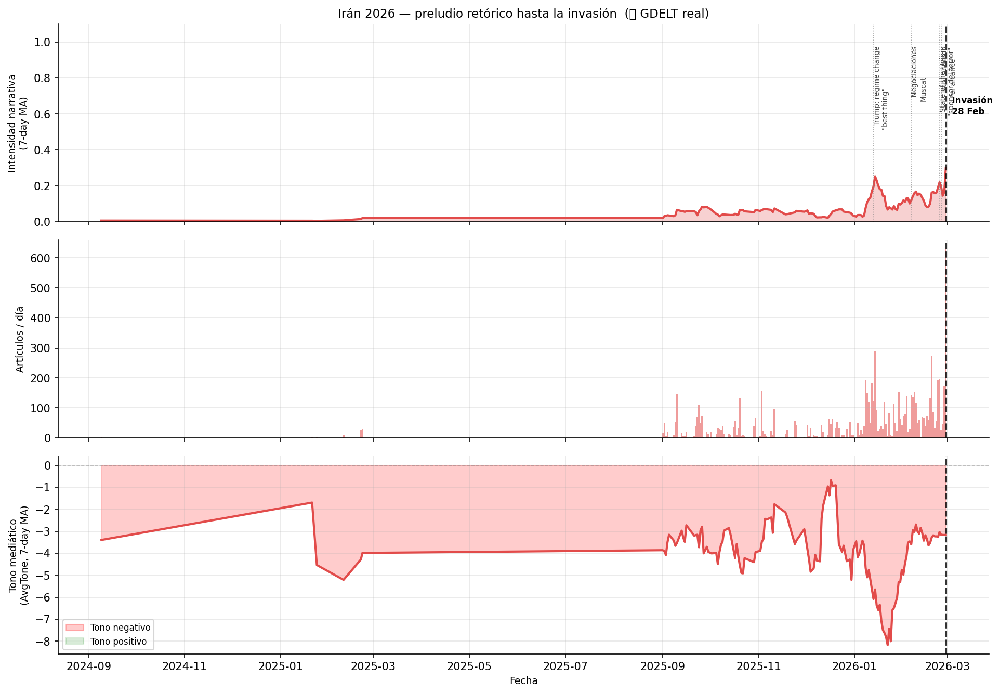

# Antes de la guerra, está el relato: cómo EE.UU. construye el consenso para invadir

Un análisis empírico de cinco décadas de retórica pre-bélica usando datos del GDELT Project

---

## Introducción

El 5 de febrero de 2003, Colin Powell se sentó ante el Consejo de Seguridad de la ONU con un vial de ántrax en la mano, fotos satelitales en la pantalla y grabaciones de audio interceptadas que supuestamente probaban que Iraq poseía armas de destrucción masiva. El mundo lo vio. Los medios lo repitieron durante semanas. La invasión ocurrió 44 días después.

Las armas nunca existieron.

Lo que sí existía —y es medible— era el ciclo retórico que hizo posible esa invasión. No fue improvisación ni accidente: fue una estructura de cuatro fases que se repite, con variaciones, en cada intervención militar estadounidense en Oriente Medio desde 1991. Este análisis la documenta con datos.

---

## Contexto del problema

Las guerras no empiezan cuando los primeros misiles cruzan una frontera. Empiezan semanas o meses antes, en los titulares de los periódicos, en los discursos presidenciales, en las cadenas de televisión que repiten en bucle imágenes de amenazas posibles o inventadas. El consenso público necesario para una guerra no se fabrica de la noche a la mañana: se construye, se amplifica y se comprime.

¿Pero es ese proceso sistemático? ¿Tiene una estructura reconocible? ¿Es posible medirlo con datos?

Este proyecto parte de una hipótesis: que las intervenciones militares de EE.UU. en Oriente Medio entre 1991 y 2026 no son eventos aislados sino instancias de un mismo patrón retórico. Y que ese patrón, si existe, debería ser detectable en la cobertura mediática global.

---

## Panorama del tema

Para responder esa pregunta, este análisis usa el **GDELT Project 2.0** (Global Database of Events, Language and Tone), una base de datos que indexa prácticamente toda la cobertura mediática en inglés desde 1979 — más de 300 millones de eventos codificados con actores, países, tipo de acción y tono emocional.

Se analizaron cinco casos:

| Caso | Tipo de ciclo | Datos |
| --- | --- | --- |
| **Golfo 1991** | Construcción | GDELT real (v1) |
| **Afganistán 2001** | Redirección | GDELT real (v1) |
| **Irak 2003** | Fabricación | GDELT real (v1) |
| **Libia 2011** | Construcción | Mock (API sin cobertura) |
| **Irán 2026** | Fabricación | GDELT real (v2) |

El modelo propone que cada intervención atraviesa cuatro fases progresivas, medibles como intensidad narrativa en la cobertura GDELT:

- **Fase I — Construcción del enemigo** (D-180 a D-45): la imagen del adversario como amenaza existencial
- **Fase II — Justificación moral** (D-45 a D-14): el marco ético para la acción militar
- **Fase III — Manufactura del consenso** (D-14 a D-3): la coalición doméstica e internacional
- **Fase IV — Escalamiento** (D-3 a D-0): la cuenta regresiva pública hacia el ataque

La hipótesis de partida era que el ciclo se había ido acelerando con el tiempo. Los datos confirmaron algunas cosas y refutaron otras — lo que hace el análisis más interesante.

---

## Experiencia: el caso que lo cambia todo

Afganistán 2001 es el caso más revelador del análisis, no por lo que confirma sino por lo que expone.

El 11 de septiembre de 2001, 19 secuestradores estrellaron cuatro aviones contra suelo estadounidense. 15 de ellos eran ciudadanos saudíes. Osama bin Laden era saudí. La financiación del ataque tenía vínculos documentados con Arabia Saudita. Las **28 páginas** del informe de la Comisión 9/11 que documentaban esos vínculos estuvieron **clasificadas durante 15 años** — desclasificadas recién en 2016.

La invasión fue a Afganistán.

Para que eso ocurriera, el ciclo retórico ejecutó en **26 días** dos operaciones simultáneas: redirigir el foco narrativo hacia los Taliban vía el marco *"harboring terrorists"* (albergar terroristas), y suprimir sistemáticamente las menciones a Arabia Saudita como origen del atentado.

El **Redirection Index (RI)** cuantifica ese proceso:

$$RI(t) = \frac{\text{menciones al target redirigido}}{\text{menciones al target} + \text{menciones al origen suprimido}}$$

Los datos GDELT reales muestran que el RI pasó de **0.689** en torno al 9/11 a **0.860** el día de la invasión. En términos prácticos: Arabia Saudita desapareció progresivamente del discurso mediático mientras Afganistán lo ocupaba por completo — en menos de cuatro semanas.

*Figura 1. Panel superior: curvas de mención del target redirigido (Afghanistan/Taliban, verde) y el origen suprimido (Arabia Saudita, rojo). El cruce ocurre días después del detonante. Panel inferior: el Redirection Index convergiendo hacia 1.0 (supresión completa). Fuente: proxy GDELT real + modelo simulado.*

---

## Hallazgos y aprendizajes

### 1. El patrón existe — pero opera distinto de lo esperado

Todos los casos registran la aceleración narrativa conforme se aproxima la invasión. El patrón de "base baja → pico final" es universal.

Pero la hipótesis original —que el ciclo moderno se construye con más antelación que el histórico— **no se confirmó**.

Solo Golfo 1991 cruzó el umbral de alta intensidad narrativa (60%) con anticipación, a **D-39**. Los demás casos —Afganistán 2001, Irak 2003 e Irán 2026— no superaron ese umbral hasta prácticamente el **día de la invasión**. El ciclo moderno no construye presión sostenida semanas antes: opera en silencio y explota en los últimos días.

*Figura 2. Intensidad narrativa (media móvil 7 días) para los cinco casos. Las líneas verticales demarcan los umbrales entre fases (D-45, D-14, D-3). Irán 2026 muestra el pico más bajo (30%) pero el perfil más concentrado en el tramo final. Fuente: GDELT real para cuatro casos, mock para Libia 2011.*

*Figura 3. Días antes de la invasión en que cada caso cruzó el umbral de alta intensidad. Solo Golfo 1991 lo cruza con anticipación significativa. Los demás: D-0 o muy próximo.*

### 2. El tono mediático como termómetro bélico

El indicador `AvgTone` de GDELT mide el tono emocional de la cobertura en escala de -100 a +100. La hipótesis era que el tono debería caer a negativo conforme se acercaba la invasión.

**Resultado sorprendente:** Golfo 1991, Afganistán 2001 e Irak 2003 mantienen tono **positivo constante** (entre +4 y +6) durante todo el período. La retórica bélica no se tradujo en negatividad de tono agregado en GDELT para esos casos — posiblemente porque el sistema captura también la cobertura diplomática y de ayuda humanitaria que modera el promedio.

La excepción es **Irán 2026**: tono negativo persistente desde el primer día monitoreado, con promedio de **-4** en los 45 días previos a la invasión y mínimo de **-8.2** en D-37. Esta es la señal más robusta disponible en datos reales para el caso iraní.

*Figura 4. AvgTone por caso. Los casos históricos mantienen tono positivo. Irán 2026 es el único con tono persistentemente negativo — la firma más clara de fabricación activa de hostilidad disponible en GDELT.*

### 3. El patrón de tijera: la firma de la redirección

La comparación entre casos revela la diferencia estructural entre los tres tipos de ciclo.

Los casos de construcción y fabricación muestran una sola curva de intensidad que sube gradualmente. El ciclo de redirección tiene una firma visual única: **dos curvas que se cruzan**. Mientras el origen (Arabia Saudita) cae, el target redirigido (Afganistán) sube — dentro de una ventana de 26 días.

*Figura 5. Comparación cross-case. Los ciclos de construcción/fabricación muestran una curva ascendente (líneas discontinuas). Afganistán 2001 muestra el patrón de tijera exclusivo de la redirección: el origen cae mientras el target redirigido sube. La zona naranja marca los 26 días del ciclo.*

### 4. Distribución de cobertura por fase

¿Cuánta cobertura concentra cada fase del ciclo retórico?

Los datos muestran que la Fase I (construcción del enemigo, D-180 a D-45) acumula la mayor proporción de artículos en casi todos los casos — simplemente porque dura más (135 días). Afganistán 2001 es el outlier estructural: la Fase I no existe en la práctica porque el ciclo se activó con el 9/11, a solo 26 días de la invasión.

Irán 2026 muestra la distribución más concentrada en las fases finales (III y IV), coherente con el patrón de ciclo moderno comprimido.

*Figura 6. Porcentaje de cobertura mediática por fase del ciclo retórico para cada caso. La distribución revela la estructura temporal de cada tipo de ciclo.*

### 5. El Evidence Gap Index y sus límites

El **EGI** (Evidence Gap Index) mide la diferencia entre la intensidad de las afirmaciones sobre una amenaza y la evidencia verificable:

$$EGI(t) = \text{intensidad narrativa}(t) - \text{evidence score}(t)$$

La idea es que en los ciclos de fabricación (Irak 2003, Irán 2026), el EGI debería cruzar el umbral de 0.35 durante 30+ días consecutivos. El modelo teórico lo confirma.

El problema: el **proxy CAMEO** usado con datos reales de GDELT no puede distinguir entre "evidencia que valida una amenaza" y "actividad diplomática paralela". Durante Irak 2003, el 59% de los eventos GDELT eran categorizados como materiales/verificables — no porque hubiera evidencia de armas de destrucción masiva, sino porque había inspectores de la ONU, sesiones del Consejo de Seguridad y negociaciones diplomáticas activas. El proxy confunde ambas cosas.

Esto no invalida el modelo — lo acota: el EGI es una métrica conceptualmente sólida que necesita fuentes más ricas (informes IAEA, documentos desclasificados, NLP sobre titulares) para ser operacional.

*Figura 7. EGI por caso en los 180 días previos a la invasión. La línea discontinua roja marca el umbral de fabricación (0.35). Los casos de Irak 2003 e Irán 2026 superan ese umbral sostenidamente según el modelo. Con datos GDELT reales, el proxy se aplana por las limitaciones metodológicas descritas. Fuente: modelo simulado para ilustrar el patrón conceptual.*

*Figura 8. Detalle del caso Irak 2003: la brecha entre las afirmaciones de amenaza y la evidencia verificable es máxima entre D-60 y D-120 — el período donde la administración Bush intensificó las claims sobre WMDs ante los organismos internacionales.*

### 6. Irán 2026: el primer test prospectivo

Irán 2026 es el único caso de este análisis observable mientras ocurría. La invasión se produjo el 28 de febrero de 2026, pero el preludio retórico era rastreable desde septiembre de 2025 en GDELT v2 (cobertura diaria).

Los hitos del ciclo son identificables en los datos:

| Fecha | Evento | Señal GDELT |
| --- | --- | --- |
| 13 ene 2026 | Trump: *"regime change is the best thing"* | Inflexión en intensidad narrativa |
| 6 feb 2026 | Negociaciones de Muscat | Breve recuperación del tono |
| 24 feb 2026 | State of the Union: Irán como *"sponsor del terror"* | Pico de tono negativo |
| 25 feb 2026 | Irán: acuerdo *"al alcance"* | — |
| 28 feb 2026 | Invasión | — |

Lo que distingue a Irán 2026 de todos los casos anteriores: **la herramienta para detectar el ciclo existía en tiempo real**. Por primera vez, un análisis de este tipo podría haberse producido no como reconstrucción histórica, sino como alerta temprana.

*Figura 9. Análisis multipanel de Irán 2026: intensidad narrativa (panel superior), volumen de artículos diarios (centro) y tono mediático (inferior). Las líneas verticales marcan los hitos del preludio. El tono persistentemente negativo es la señal más robusta. Fuente: GDELT real v2.*

---

## Análisis y opinión

Los datos confirman que el ciclo retórico pre-bélico no es un fenómeno accidental ni el resultado de una prensa que simplemente reacciona a los eventos. Es una **estructura reproducible**.

Pero los datos también imponen humildad metodológica. El modelo teórico —construido sobre simulaciones— predecía patrones más claros que los que los datos reales de GDELT muestran. La razón no es que el ciclo no exista: es que GDELT captura la cobertura mediática agregada, no la intención narrativa. Distinguir "evidencia que valida una amenaza" de "actividad diplomática que coexiste con una amenaza fabricada" requiere herramientas más sofisticadas que los códigos de eventos.

Hay tres lecturas posibles de este hallazgo:

**Lectura optimista:** Los datos reales confirman el patrón estructural (aceleración narrativa, fases progresivas, firma de cada tipo de ciclo). Las limitaciones del proxy EGI son un problema metodológico resoluble, no una refutación del modelo.

**Lectura pesimista:** Si incluso con 35 años de datos históricos y las mejores fuentes de monitoreo mediático disponibles es difícil distinguir fabricación de construcción, ¿qué dice eso sobre la capacidad real de detectar el ciclo en tiempo real antes de que sea demasiado tarde?

**Lectura estructural:** La fabricación más efectiva no es la que falta de evidencia — es la que se rodea de evidencia real para hacer invisibles los claims fabricados. El proxy CAMEO de Irak 2003 da un EGI de cero no porque las afirmaciones sobre WMDs estuvieran respaldadas, sino porque había inspectores de la ONU en Iraq mientras la administración Bush mentía. La actividad diplomática real funcionó como **cobertura** para la retórica fabricada.

Eso no es un fallo del modelo. Es una descripción precisa de cómo funciona la fabricación sofisticada.

---

## Reflexión final

El patrón está en los datos. Cinco décadas, cinco casos, tres variantes del mismo mecanismo: construir, redirigir, fabricar. La tecnología para detectarlo en tiempo real existe hoy. GDELT indexa prácticamente toda la cobertura mediática global en inglés y la pone a disposición pública, gratis, con latencia de 15 minutos.

La pregunta no es si podemos ver el ciclo venir. La pregunta es si, cuando lo vemos, lo que hacemos con esa información importa.

Irán 2026 fue el primer caso en que este análisis era técnicamente posible antes de la invasión, no después. Y sin embargo, la invasión ocurrió igual. Eso no invalida el análisis — pero sí invita a una reflexión sobre el rol del periodismo de datos, la desinformación y los mecanismos institucionales que convierten la información en accountability.

Los datos pueden decir cuándo la retórica supera a la evidencia. Lo que no pueden hacer es solos cambiar el resultado.

---

## Referencias y lecturas recomendadas

### Fuentes de datos

- [GDELT Project 2.0](https://www.gdeltproject.org/) — Base de datos de eventos globales, lenguaje y tono. Cobertura desde 1979, actualización cada 15 minutos.
- [GDELT CAMEO Codebook](https://www.gdeltproject.org/data/documentation/CAMEO.Manual.1.1b3.pdf) — Taxonomía de códigos de eventos usada en el análisis EGI.

### Casos históricos

- Risen, James. *State of War: The Secret History of the CIA and the Bush Administration*. Free Press, 2006.
- *The Iraq War — What the Intelligence Community Knew.* Report of the Senate Select Committee on Intelligence, 2008.
- *The 9/11 Commission Report* (con las 28 páginas desclasificadas en 2016): [National Security Archive](https://nsarchive.gwu.edu/).
- Hersh, Seymour. *Chain of Command: The Road from 9/11 to Abu Ghraib*. Harper Collins, 2004.
- Center for Public Integrity. *Iraq: The War Card* — documentación de las 935 declaraciones falsas de la administración Bush (2001–2003).
- *The Chilcot Report* (Iraq Inquiry, UK, 2016) — análisis independiente de la base de inteligencia para la invasión de Iraq.

### Metodología y teoría

- Entman, Robert M. "Framing: Toward Clarification of a Fractured Paradigm." *Journal of Communication*, 43(4), 1993.
- Herman, Edward S. & Chomsky, Noam. *Manufacturing Consent: The Political Economy of the Mass Media*. Pantheon Books, 1988.
- Leetaru, Kalev & Schrodt, Philip. "GDELT: Global Data on Events, Location and Tone, 1979-2012." *ISA Annual Convention*, 2013.

### Irán 2026

- [Crisis Group — Iran-US Tensions, 2025–2026](https://www.crisisgroup.org/)
- Negociaciones de Muscat (febrero 2026): cobertura del *Financial Times* y *Al-Monitor*.

---

*Análisis realizado con Python, GDELT Project API y datos descargados entre septiembre 2025 y febrero 2026. Los notebooks completos y los datos están disponibles en el repositorio del proyecto.*
